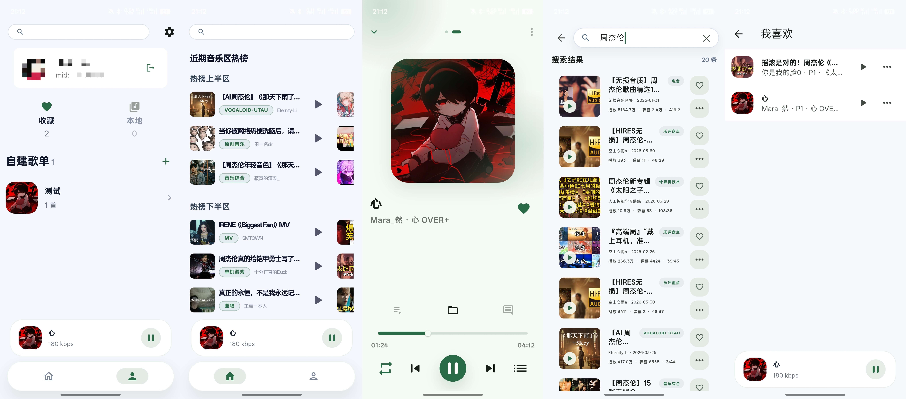

# 做了一个APP,叫BiliMusic

顾名思义,这是一个B站源音乐APP.

仓库地址:[AprDeci/bili-music](https://github.com/AprDeci/bili-music)

一直想写一个音乐APP,也算是实现了吧.

## 25.4.16

现在在做webdav存储功能.

我发现很多功能还真是不好做,譬如目前有两个BUG我根本无从解决

- 收藏页进入player页 返回 会直接退出收藏
- 与其他应用同时播放-抖音开启后会降低音乐关闭后不会再回到原来音量

一个应该是gorouter的BUG,拦截手势也无用.

一个是抖音关闭后不知道该如何捕获到这个回调.

已经37star了,刚刚看了一下v1.2.0下载量有88,真是让我惶恐.

## 25.5.6
桌面端也写了 下一步是把metingapi去掉,用dart重写吧
还有收藏夹的改进和内存优化.